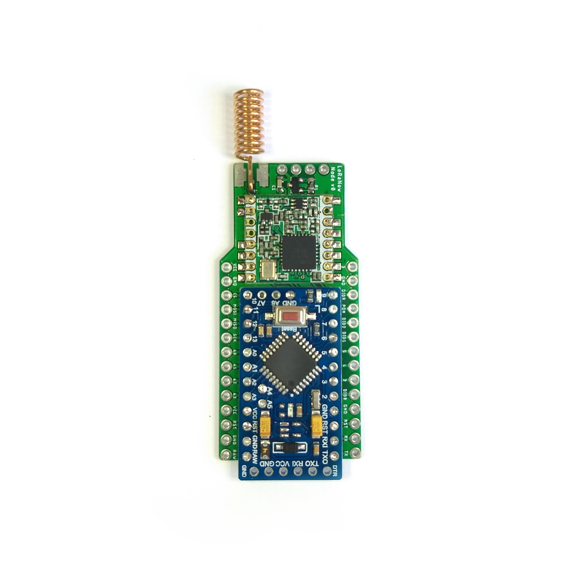
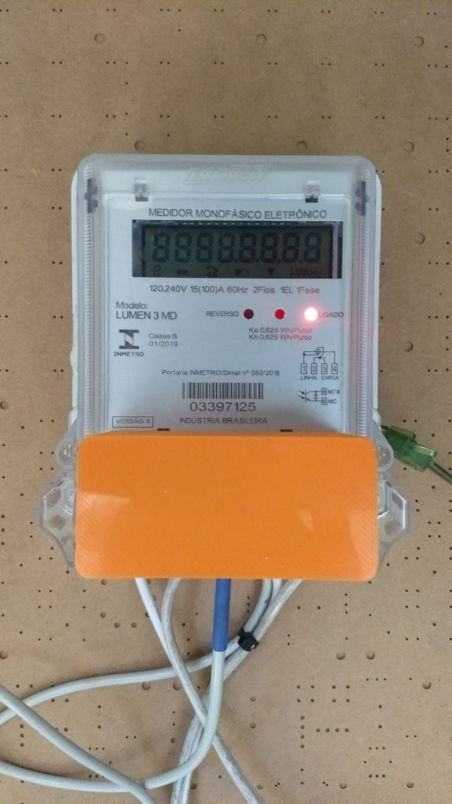

# LoRaWan_Energy_Meter

Project to read the energy meter using the [Unidirectional Asynchronous Serial Output (PIMA)][4] and send the data using LoRaWAN to [TTN][5].

## Librays

* [LoRa][1]
* [LoRaWanPacket][2]
* [ArduinoUniqueID][3]
* [Unidirectional Asynchronous Serial Output (PIMA)][4]

# Meter

`LUMEN 3 MD` is a Brazilian electrical monophasic meter from `Nansen`.

* [Instruction manual in Portuguese][20].

## Communication

The connection with the meter and the device is using the [Unidirectional Asynchronous Serial Output (PIMA)][4] protocol. 

It is a Serial communication, the meter sends the meter id and the power consuption `kvh` (the same value that shows on the display of the meter).

For more information about the protocol check the library [arduino-PIMA][4].

The receive information is send using LoRaWAN with [LoRaNow V0 board][10].

# Images

## LoRaNow V0

## Meter with LoRaNow V0

## License

This library is [licensed](LICENSE) under the [MIT Licence](https://en.wikipedia.org/wiki/MIT_License).

---

Do you like this library? Please [star this project on GitHub](https://github.com/ricaun/LoRaWan_Energy_Meter/stargazers)!

[1]:https://github.com/sandeepmistry/arduino-LoRa
[2]:https://github.com/ricaun/LoRaWanPacket
[3]:https://github.com/ricaun/ArduinoUniqueID
[4]:https://github.com/ricaun/arduino-PIMA
[5]:https://www.thethingsnetwork.org/

[10]:https://github.com/ricaun/LoRaNow-board

[20]:https://cdn.awsli.com.br/1161/1161030/arquivos/Manual%20Lumen%203MD%20Monofasico.pdf